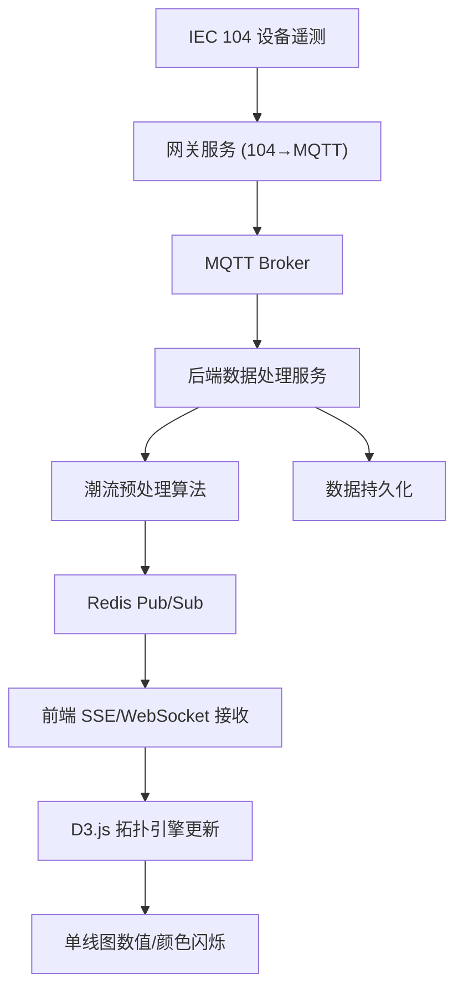

## 1. 产品概述

智能电网调度中心可视化与实时数据处理系统，为电力调度人员提供变电站电气单线图的动态拓扑展示与实时遥测数据监控。系统接入 IEC 104 规约设备（断路器、母线、变压器），通过 MQTT 协议桥接后端网关，利用 Redis Pub/Sub 实现毫秒级数据推送，使前端单线图上的电流/电压数值与母线颜色实时闪烁更新。

- **核心目标**：实现从底层设备遥测到前端可视化全链路的低延迟数据通道，支持调度员实时掌握电网运行状态
- **目标用户**：电力调度中心调度员、运维工程师

## 2. 核心功能

### 2.1 用户角色

| 角色 | 登录方式 | 核心权限 |
|------|----------|----------|
| 调度员 | 工号+密码登录 | 查看实时拓扑、遥测数据、告警信息 |
| 运维工程师 | 工号+密码登录 | 设备管理、规约配置、系统维护 |

### 2.2 功能模块

1. **调度主页面**：变电站电气单线图实时展示、设备遥测数据动态标注、母线颜色随状态变化闪烁
2. **潮流分析页面**：线路有功/无功功率分布可视化、潮流方向箭头动画、功率越限告警
3. **系统监控页面**：设备在线状态、数据通道质量、历史曲线回看

### 2.3 页面详情

| 页面名称 | 模块名称 | 功能描述 |
|----------|----------|----------|
| 调度主页面 | 拓扑画布 | 基于 SVG/D3.js 的电气单线图渲染，支持缩放/平移/拖拽 |
| 调度主页面 | 实时数据标注 | 电流、电压、功率数值实时更新，越限时红色闪烁 |
| 调度主页面 | 设备状态面板 | 点击设备弹出详细遥测信息面板 |
| 调度主页面 | 告警栏 | 底部滚动显示最新告警信息 |
| 潮流分析页面 | 功率分布图 | 各线路有功/无功功率条形图与方向箭头 |
| 潮流分析页面 | 越限告警 | 功率超过额定值时高亮显示并告警 |
| 系统监控页面 | 通道状态 | IEC 104 通道连接状态、MQTT Broker 状态 |
| 系统监控页面 | 历史曲线 | 选定测点的历史数据曲线图 |

## 3. 核心流程

调度员登录系统后，主页面加载变电站拓扑 JSON 并由 D3.js 渲染电气单线图。后端网关持续接收 IEC 104 遥测数据，经 MQTT 桥接后通过 Redis Pub/Sub 推送至前端，单线图上对应设备的数值标签与母线颜色实时刷新。调度员可切换至潮流分析页面查看有功/无功功率分布，或进入系统监控页面检查通道状态与历史曲线。

## 4. 用户界面设计

### 4.1 设计风格

- **主色调**：深蓝黑 (#0a1628) 背景 + 电力蓝 (#00b4d8) 主色 + 告警橙 (#ff6b35) 辅色
- **按钮风格**：圆角微透明，hover 时发光效果
- **字体**：数据用等宽字体 JetBrains Mono，界面用 Noto Sans SC
- **布局风格**：左侧导航栏 + 顶部工具栏 + 中央画布 + 底部告警栏
- **图标风格**：线性图标，2px 描边，电力行业风格化

### 4.2 页面设计概览

| 页面名称 | 模块名称 | UI 元素 |
|----------|----------|---------|
| 调度主页面 | 拓扑画布 | 深色背景 SVG 画布，D3.js 渲染设备符号与连线，缩放/平移控件 |
| 调度主页面 | 实时数据标注 | 设备旁的等宽数字标签，正常绿色、越限红色闪烁 |
| 调度主页面 | 母线颜色 | 带电绿色、断电灰色、故障红色，带脉冲动画 |
| 调度主页面 | 告警栏 | 底部半透明滚动条，告警项带时间戳与级别图标 |
| 潮流分析页面 | 功率分布 | 线路上动态箭头表示潮流方向，数值标签显示 MW/MVar |
| 系统监控页面 | 通道状态 | 绿/红圆点表示在线/离线，右侧文字说明 |

### 4.3 响应式设计

桌面优先设计，核心画布区域占满可用空间。左侧导航栏可折叠以增加画布面积。在窄屏下告警栏收缩为浮动面板。

### 4.4 动效设计

- 母线脉冲动画：CSS keyframe 实现呼吸灯效果
- 数据闪烁：数值变化时 scale + opacity 过渡
- 潮流箭头：SVG animate 沿路径移动
- 页面切换：淡入淡出过渡
