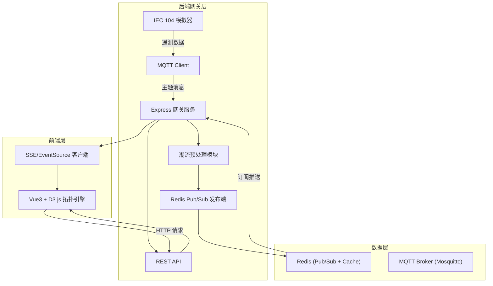
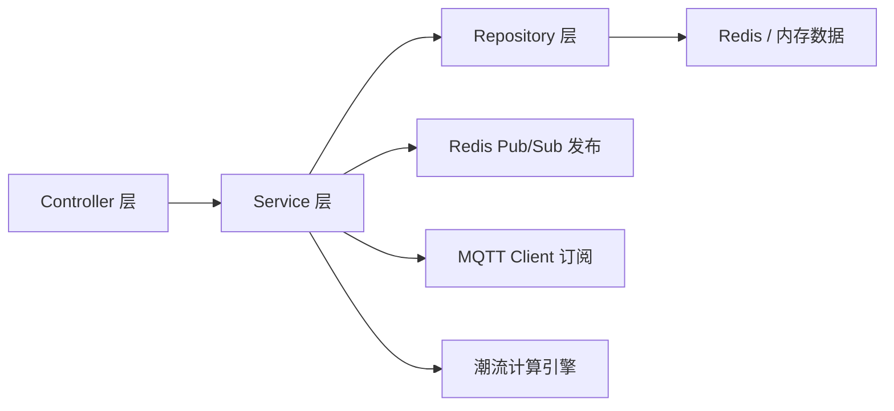
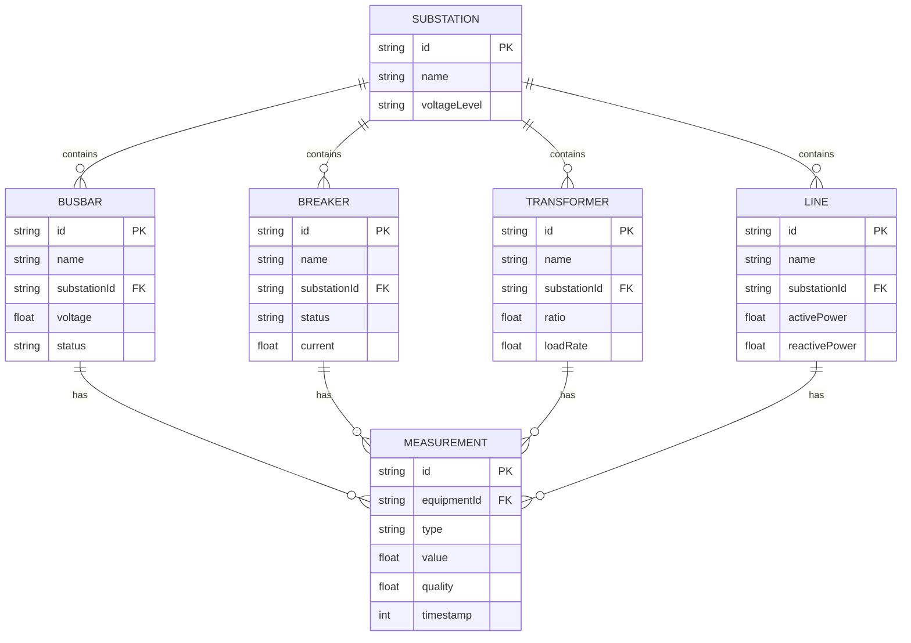

## 1. 架构设计



## 2. 技术说明

- **前端**：Vue3 + TypeScript + D3.js + Vite + Tailwind CSS
- **项目初始化工具**：vite-init (vue-express-ts 模板)
- **后端**：Express@4 + TypeScript (ESM)
- **实时通信**：Server-Sent Events (SSE) 推送遥测数据（前端通过 EventSource 接收 Redis Pub/Sub 的消息）
- **消息中间件**：MQTT (mosquitto) 作为 104 规约数据桥接、Redis Pub/Sub 作为后端到前端推送通道
- **数据存储**：Redis (缓存最新遥测值 + Pub/Sub)、内存数据（拓扑 JSON、潮流计算结果）
- **图标库**：lucide-vue-next

## 3. 路由定义

| 路由 | 用途 |
|------|------|
| `/` | 调度主页面：电气单线图实时展示 |
| `/power-flow` | 潮流分析页面：有功/无功功率分布 |
| `/monitor` | 系统监控页面：通道状态与历史曲线 |

## 4. API 定义

### 4.1 拓扑数据

```typescript
interface TopologyNode {
  id: string
  type: "breaker" | "busbar" | "transformer" | "line" | "generator" | "load"
  name: string
  x: number
  y: number
  voltage?: number
  status?: "on" | "off" | "fault"
}

interface TopologyLink {
  id: string
  source: string
  target: string
  type: "electrical" | "bus-tie"
  activePower?: number
  reactivePower?: number
  currentFlow?: number
}

interface TopologyData {
  nodes: TopologyNode[]
  links: TopologyLink[]
  substationName: string
  voltageLevel: string
}
```

### 4.2 遥测数据推送 (SSE)

```typescript
interface TelemetryUpdate {
  nodeId: string
  metrics: {
    current?: number
    voltage?: number
    activePower?: number
    reactivePower?: number
    frequency?: number
  }
  timestamp: number
  quality: "good" | "invalid" | "old"
}
```

### 4.3 REST API

| 方法 | 路径 | 描述 |
|------|------|------|
| GET | `/api/topology` | 获取变电站拓扑 JSON |
| GET | `/api/telemetry/latest` | 获取所有测点最新值 |
| GET | `/api/telemetry/stream` | SSE 实时遥测数据流 |
| GET | `/api/power-flow` | 获取潮流计算结果 |
| GET | `/api/monitor/channels` | 获取 IEC 104 通道状态 |
| GET | `/api/telemetry/history/:nodeId` | 获取指定测点历史数据 |

## 5. 服务端架构图



## 6. 数据模型

### 6.1 数据模型定义



### 6.2 Redis 数据结构

```
# 最新遥测值缓存 (Hash)
telemetry:latest:{nodeId} -> { current, voltage, activePower, reactivePower, timestamp, quality }

# 拓扑数据缓存 (String/JSON)
topology:{substationId} -> JSON string

# 潮流计算结果缓存 (String/JSON)
powerflow:{substationId} -> JSON string

# Pub/Sub 频道
telemetry:updates -> 实时遥测更新消息
```
